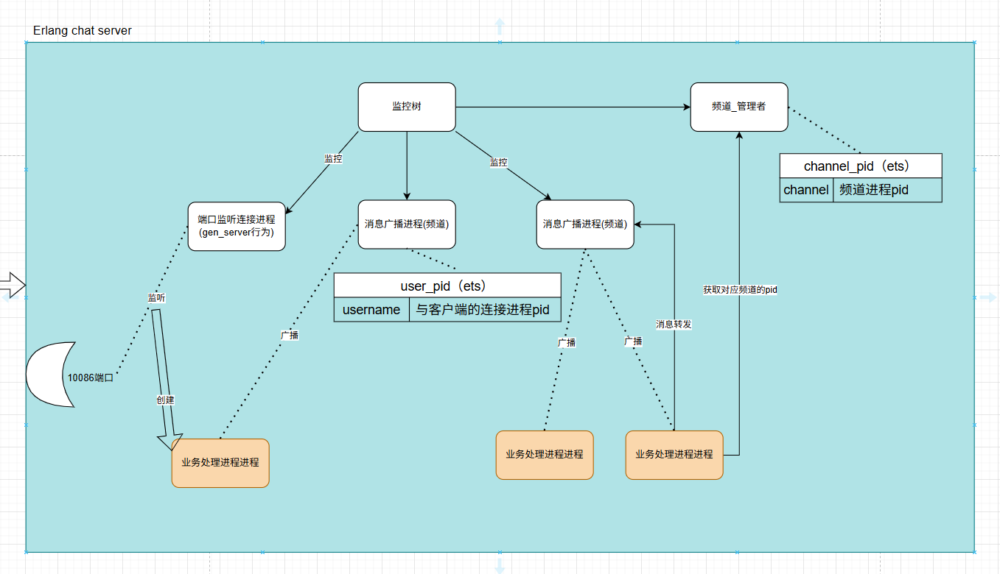

任务要求:
① 用 erlang,来写客户端模拟机器人。并发可以支持到 200 人以上。 
② 将之前频道的概念换成地图，地图内有不同的格子，按你自己的理解加上模拟走路的功能，走路就是从 A格子移动到 B格子。
③ 玩家连接聊天后，按照每 60秒一次的概率发言，发言内容读取随机文本串，可以在客户端界面3直接显示。
④ 按照每 2秒一次的概率走路，走路则打印类似的文本:“测试机器人 0001 正走到xx格子”A

我的chatroom实现思路，具体代码查看 chat-room-server 或者 chat-room-server-tcp仓库

每个客户端连接之后都会有单独的进程处理，它们会向已加入的频道进程注册自己的登录信息，每个频道都会维护一份加入了频道且登录连接中的客户端处理进程pid和用户名字
这样用户往频道内发送消息后，处理进程会将该消息发送到对的频道进程，该频道进程会广播消息，这也就意味着用户已加入的频道的消息都能接受

我理解的要求：
① 一个频道就是一个地图  ---》 则需要一开始启动应用的时候初始化地图数据，每个频道的状态存储地图数据（测试用list即可） 还是说地图数据存储在客户端？
② 每两秒走一次路 --》 即每两秒发送一次走路请求给服务器，随机数查list元素走路
③ 每60秒随机发言 --》 即每60秒往频道发言，发言文本由客户端处理（生成随机数，读取文本的某一行内容，然后发言）

